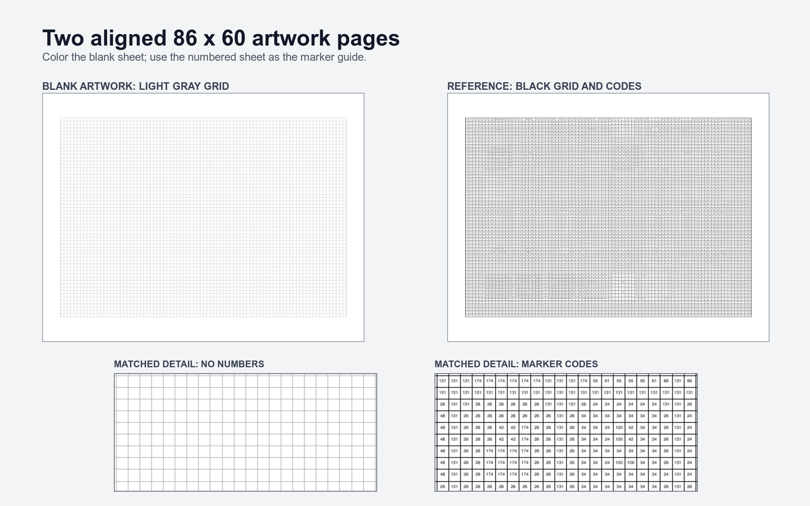

# Color-by-number tool

Turn any photograph into a printable, configurable color-by-number pattern for artists who need
exactly one Aoartix marker code in every unfilled square by default, oriented to match the source.

<!-- screenshots:begin (managed by screenshot-docs) -->

<!-- screenshots:end -->

## From photo to 5,160 decisions

The tool reduces a photograph to a strict physical worksheet instead of a blended digital effect.
By default, every square is an independent, usable marker decision:

- 86 columns by 60 rows in landscape by default, or 60 columns by 86 rows in portrait.
- Configurable grid resolution through `-g COLUMNSxROWS` or `--grid COLUMNSxROWS`.
- Optional `-m` merging of edge-adjacent shapes assigned the same marker code into one printable
  region.
- By default, one printed marker code in every square; with `-m`, one code in each connected
  same-color printable region, including codes such as `120` and `BG7`.
- White worksheet cells with black grid lines and no pre-colored boxes.
- Sharp ReportLab vector PDFs with square cells and measured Letter-page margins.
- Perceptual matching against the supplied 48-color Aoartix marker set.
- Selective shadow-detail expansion that keeps dark textured colors from collapsing into black.
- Separate source and marker previews for judging the result before printing.

ReportLab creates a one-page reference PDF and a two-page final-artwork PDF as crisp vector artwork.
The reference places the numbered grid beside a colored marker key. The artwork PDF uses the largest
grid that fits within 0.6-inch Letter margins: page one is a light-gray blank grid, and page two is
the exactly aligned black numbered grid. Wide and square sources use landscape; tall sources use
portrait.

Color the blank first artwork page while reading marker codes from the second page. The matching
cell geometry keeps the final picture free of printed numbers.

## Before the first print

The built-in RGB values come from the supplied product chart, not physical ink swatches. Alcohol
ink appearance changes with paper, lighting, and camera capture. The chart palette is a useful
starting point; measured swatches on the final paper provide the closest physical match.

The default 86 by 60 resolution retains more facial detail than the original 43 by 30 grid, but
the marker palette still limits color detail. Use the generated source and marker previews to judge
the crop and resolution before printing the worksheet.

The default strong enhancement changes only two measured color groups: locally changing dark
colors receive a shadow curve, and warm midtones receive a modest chroma boost. Flat backgrounds
and neutral black regions keep ordinary nearest-color matching. Use `-e none` for the unmodified
baseline or `-e balanced` for a gentler treatment.

## Quick start

Use Python 3.12 and install the packages in `pip_requirements.txt` as described in
[docs/INSTALL.md](docs/INSTALL.md). Then run the included marker chart through the complete path:

```bash
source source_me.sh && python3 color_by_number.py -i palettes/marker_image_set.jpg
```

The command creates seven artifacts under `output/`:

```text
Created 86 x 60 landscape color-by-number diagram:
  diagram: output/pdf/color_by_number.pdf
  artwork pages: output/pdf/color_by_number_grid_only.pdf
  marker preview: output/pdf/color_by_number_marker_preview.png
  source preview: output/pdf/color_by_number_source_preview.png
  assignments: output/pdf/color_by_number_assignments.csv
  legend: output/pdf/color_by_number_legend.csv
  summary: output/pdf/color_by_number_summary.txt
```

Open `output/pdf/color_by_number_grid_only.pdf` and print both pages in its generated orientation.
Use `output/pdf/color_by_number.pdf` for the colored marker key. Replace the input path with the
photograph to convert.

## Try a public-domain portrait

These museum records provide downloadable public-domain images, so they are useful reproducible
examples without adding a large source image to this repository. Attribution is not required for
public-domain works, but keep the artist, title, and museum with shared results:

- Diego Velazquez, *Juan de Pareja*, The Metropolitan Museum of Art:
  [collection record](https://www.metmuseum.org/art/collection/search/437869) and
  [full-resolution original](https://images.metmuseum.org/CRDImages/ep/original/DP-14286-001.jpg).
  The Met marks the image Public Domain. Its dark skin, hair, clothing, and warm brown shadows test
  whether the palette preserves dark detail instead of collapsing it into marker `120`.
- Jean-Auguste-Dominique Ingres, *Madame Moitessier*, National Gallery of Art:
  [public-domain collection record and download](https://www.nga.gov/artworks/32696-madame-moitessier).
  The gallery marks the object's media free and in the public domain. Pale skin, black clothing,
  flower colors, and the patterned maroon wall test light skin separation and saturated reds.
- Vincent van Gogh, *Self-Portrait with a Straw Hat*, The Metropolitan Museum of Art:
  [public-domain collection record and download](https://www.metmuseum.org/art/collection/search/436532).
  The Met marks the image Public Domain. Alternating blue, yellow, orange, and green brushwork tests
  how a limited marker palette handles rapid hue changes and visible texture.

Download one image, save it locally, and pass its path to `-i`. Keep the museum attribution in any
published comparison so other readers can reproduce the same test.

## One image, seven artifacts

| Output | What it provides |
| --- | --- |
| `color_by_number.pdf` | One Letter page with the white code grid and a colored side key. |
| `color_by_number_grid_only.pdf` | Aligned blank-gray and black-numbered full-grid Letter pages. |
| `color_by_number_marker_preview.png` | The photograph reconstructed with marker colors. |
| `color_by_number_source_preview.png` | The unquantized, orientation-matched source-color reference. |
| `color_by_number_assignments.csv` | The code, name, and RGB choice for every grid position. |
| `color_by_number_legend.csv` | Every palette entry with base square and rendered-region counts. |
| `color_by_number_summary.txt` | Grid and merge settings, base and rendered-region counts, reduction, and Delta E metrics. |

Use `-o output/pdf/family_portrait.pdf` to choose the worksheet filename. All companion files inherit
the `family_portrait` stem. Use `-f contain` to preserve the complete source image instead of center
cropping it.

Automatic page orientation follows the EXIF-corrected source dimensions. Use `-L` or `--landscape`
to force landscape or `-P` or `--portrait` to force portrait. The default `-g 86x60` value describes
landscape columns by rows; portrait swaps it to 60 by 86. Square sources use landscape unless
overridden. Use another resolution, such as `-g 43x30`, for larger physical squares.

Choose `-e none`, `-e balanced`, or `-e strong`. The strong default was selected from controlled
comparisons on `kimi-face.png`: it exposes the most hair structure and restores warm skin
separation, while balanced remains closer to the source under Delta E 76.

## Aoartix marker palette

The built-in [palettes/aoartix_48.yml](palettes/aoartix_48.yml) palette contains all 48 codes and
names from [palettes/marker_image_set.jpg](palettes/marker_image_set.jpg). Each RGB triplet is the
median flat-background color sampled from its reference-chart swatch.

## Documentation

- [docs/INSTALL.md](docs/INSTALL.md): Python 3.12 requirements and dependency setup.
- [docs/USAGE.md](docs/USAGE.md): fitting, sizing, custom palette, and output options.
- [docs/REGION_PIPELINE.md](docs/REGION_PIPELINE.md): printable-region lifecycle, merging, and
  renderer handoff.
- [docs/CODE_ARCHITECTURE.md](docs/CODE_ARCHITECTURE.md): pipeline stages, module boundaries, and
  data flow.
- [docs/FILE_STRUCTURE.md](docs/FILE_STRUCTURE.md): source, palette, test, and generated-output
  locations.
- [docs/VISION_PIPELINE.md](docs/VISION_PIPELINE.md): image-processing contract, metrics, and
  limitations.

## License

The source code is available under the [MIT License](LICENSE.MIT.md).
